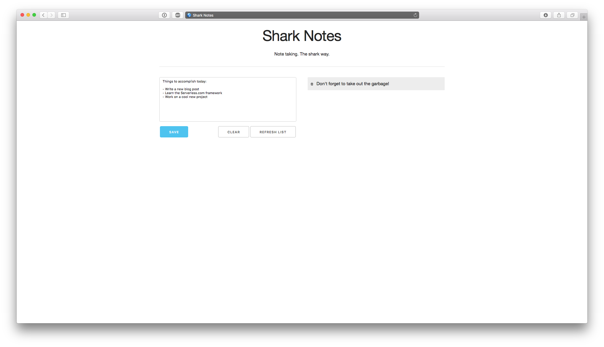

# Shark Notes (DEPRECATED)

This repository is deprecated in favor for [this one](http://github.com/justserverless/notes)

---

Note taking application which implements CRUD operations.

Developed with the help of the [Serverless framework](http://serverless.com).

## Setup
1. Clone the repository
2. Install the cloned project with the `serverless project install <project-name>` command
3. Deploy the functions and endpoints with the `serverless dash deploy` command
4. Replace the API.rootUrl variable in `www/app.js` with your API endpoint
5. Optional: Deploy the static resources in the `www` directory as a static site hosted on S3 (follow [this guide](https://medium.com/@gargar454/setup-an-aws-s3-static-site-with-3-clicks-b02c7de4544f#.8qbrwey57) to do so)
